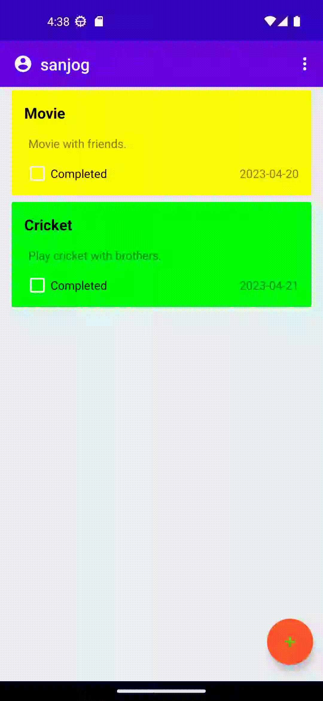

# TodoApp

<h1>Features of TodoApp</h1>
<ul>
	<li>Add your todo with title, description, complete status and date.</li>
	<li>Edit the todo that were added by double tab the given each lists.</li>
	<li>Display the todo specific to the user in the home page.</li>
	<li>Delete individual todo by swiping.</li>
	<li>Delete all the todos that are completed.</li>
	<li>Delete all the todos.</li>

</ul>

<h1>Additional features</h1>
<ul>
    <li>Form validation.</li>
	<li>Change completion status of todo from home page.</li>
	<li>Multiple account signup and login.</li>
	<li>View your account profile and change password.</li>
	<li>Delete your account.</li>
</ul>

### Starting of the application

**The above gif file shows the starting phase of the application by clicking the todo icon from the mobile.
When the program is launched, the user is taken to the main page, also known as the front page.**

---

### Registration

**We need to register in order to login.**

**Register detail name must be different validation and empty validation.**

**The aforementioned two records serve as an example of a registration form containing validation features including an empty field, an existing user, and a password that does not match. Once registration is complete, a toast message indicating registration completion will appear.**

---

### Login

**Validation is done for login. After login successful.**

**The record includes all about the application's login process, including validation such as the user does not exist, empty forms, and username and password that do not match. Once logged in successfully, we may check our profile, remove just completed tasks, delete all tasks, log out of our account, and perform basic operations on the tasks via the to-do list page.**

---

### Add

**Adding the items in the list.**

**The Record details how tasks are added to the to-do list. The task may be added to the list by clicking the floating action button in the bottom left corner. After clicking the save button, the form will then redirect to the task insert form, where the task's details can be entered. Finally, it will reroute to the to-do list page, where the task details will be shown in accordance with the desired priority color selected for each activity.**

---

### Update

**Double tab the given items for update.**

**This Record is devoted to the task updating procedure. The job is updated by a double tab event.
When this event is finished, a redirect to the task update form with the pertinent data will appear. When the update button is used, the website will reload to display the to-do list, and when the cancel button is pressed, the task will not be updated.**

---

### Delete

**You can delete task by swiping left and right the task.**

**Swiping the task left or right will immediately delete the task, and a toast notification will appear after the task has been erased.**

---

### User Profile

**In user profile page change password and delete password can be done.**

**We may access the user profile page, where we can deactivate our individual account and change our password, by clicking the profile name or icon in the toolbar.**

---

### List

**View the list of data.**

**This page shows the all the todo task.**

---

### Delete task selected Completed tasks only

**Open the menu options and select delete completed to delete completed tasks only.**

---

### Delete All

**Open the menu options and select delete all to delete every tasks.**

---

### Logout

**To logout from the app, you can click the power off button on the menu bar.**

---

### Landscape 

**Run whole application in landscape.**

**The above record shows the whole application page with landscape.**

---
